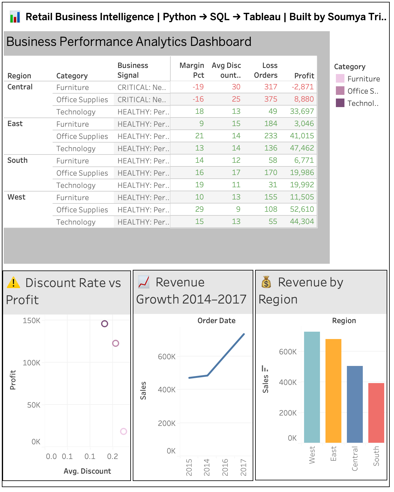

# 📊 retail-performance-analytics

> End-to-end analytics pipeline: Python ETL → SQLite → SQL → 
> Tableau dashboard with automated profit signal engine

---

## 🎯 Problem
Retail executives need visibility into where the business is losing 
money — which regions, categories, and discount strategies are 
eroding profitability.

---

## 💡 Key Findings
- **Central region Furniture & Office Supplies = CRITICAL** — 
  negative margins of -19% and -16% respectively
- **317 loss-making orders in Furniture alone** with avg discount of 30%
- **Revenue grew 47% from 2014–2017** despite margin erosion in key categories
- Automated signal engine flags 2 region-category combinations 
  requiring immediate pricing review

---

## 🏗️ Architecture
Raw CSV → Python ETL (Pandas) → SQLite DB → SQL Views → 
Tableau Dashboard

---

## 🛠️ Tech Stack
| Layer | Tool |
|-------|------|
| ETL | Python, Pandas, NumPy |
| Storage | SQLite |
| Analysis | SQL |
| Visualization | Tableau Public |
| Version Control | Git, GitHub |

---

## 🚀 How to Run
1. Clone: `git clone https://github.com/soumyatripathy/retail-performance-analytics`
2. Install: `pip3 install pandas numpy jupyter`
3. Add dataset to `data/raw/superstore.csv`
4. Run: `jupyter notebook notebooks/01_ETL_Pipeline.ipynb`
5. View live dashboard: [Business Performance Analytics Dashboard](https://public.tableau.com/app/profile/soumya.tripathy/viz/BusinessPerformanceAnalyticsDashboard/BusinessPerformanceAnalytics?publish=yes)

---

## 📸 Dashboard Preview


---

## 📋 Business Recommendations
1. Immediate discount strategy review for Central Furniture — 
   -19% margin with 317 loss orders identified
2. Central Office Supplies discount rate at 25% driving -16% margin — 
   pricing reset needed
3. West and East regions healthy — replicate their discount 
   discipline across Central
```
